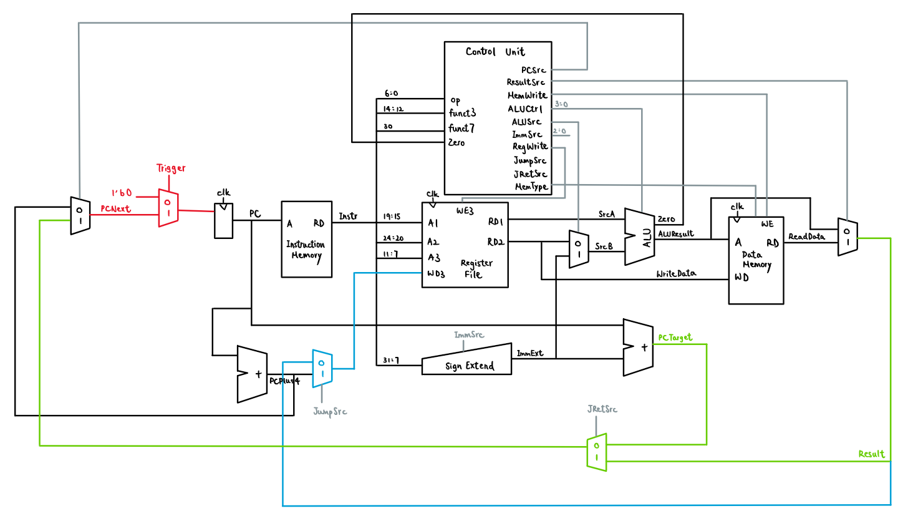

# Single-cycle RV32I CPU

</center>

<p align="center">  </p>

> Design of our single-cycle processor.

## Testing Instructions

### Step 1: Clone the Repo
### Step 2: Configure vbuddy.cfg
Connect Vbuddy to your computer's USB port using a USB cable provided. Find out the name of the USB device used, and configure vbuddy.cfg (which contains the device name as the only line (terminated with CR))

Currently all the vbuddy.cfg files have the port number set as USB0. If this is not the case for yours, please change it accordingly!

### Step 3: Execute Shell Script

#### F1 Program

```bash
source ./f1.sh

```

#### PDF Program

```bash
source ./pdf.sh

```

To test the PDF Program with different dataset, please go to rtl/DataMemory.sv and change line 17 manually.

## Testing Evidence
### F1 Program

#### Trigger

https://github.com/zoezheng04/Team-8/assets/147674445/93782107-cc51-4b60-bae0-e152f17378de

#### One second delay

https://github.com/zoezheng04/Team-8/assets/147674445/6ffda6d7-ccf6-4d8e-bccf-b58c25ef1f0e

### PDF Program

#### gaussian.mem

https://github.com/zoezheng04/Team-8/assets/147674445/61daf9dd-aed0-4160-9967-ca846508ca86

#### noisy.mem

https://github.com/zoezheng04/Team-8/assets/147674445/6943c012-eed3-46b3-8593-adf3687e76e6

#### sine.mem

https://github.com/zoezheng04/Team-8/assets/147674445/673d5f5c-e27b-4fe0-b4b4-f0868a9eb3b9

#### triangle.mem

https://github.com/zoezheng04/Team-8/assets/147674445/99beb246-c35e-4618-adb6-0fab67835c3c

> Please be aware that the videos provided here are shortened and compressed to facilitate embedding in the README.md. For uncompressed versions, refer to the "test" folder.

