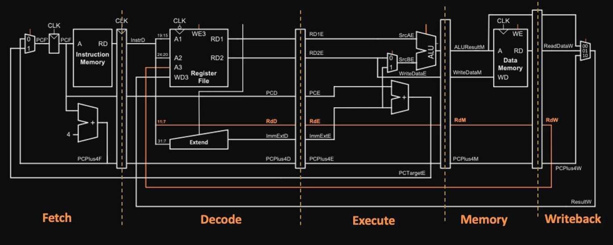
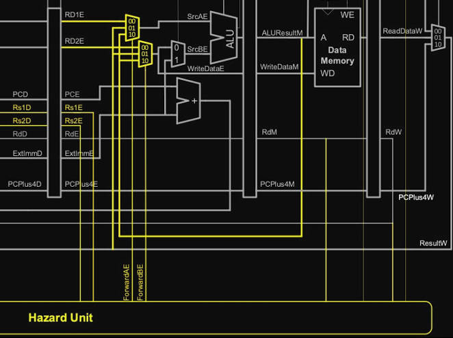
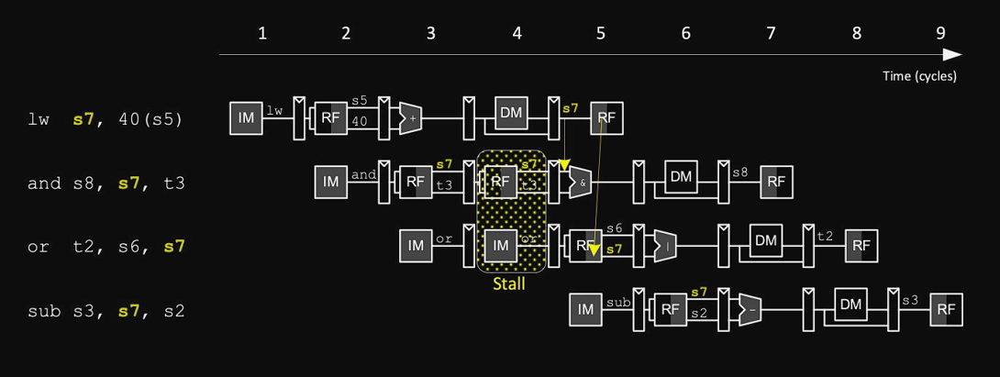

# Individual Statement - Arjan Hayre
## Table of Contents
- [Overview](#overview)
- [Control Unit](#Control-Unit)
- [Pipelined CPU](#Pipelined-CPU)
  - [Pipeline Registers](#Pipeline-Registers)
  - [Hazard Unit](#Hazard-Unit)
      -[Data Hazards](#Data-Hazards)
      -[Load Hazards](#Load-Hazards)
      -[Control Hazards](#Control-Hazards)
- [Top file and Testing](#Top-file-and-Testing)
- [Minor Changes and optimisations](#Minor-Changes-and-optimisations)   
- [Reflection](#reflection)
  
## Overview
This statement gives an overview of my contributions to the project. All design decisions, modules, files abd any relevant structural or minor changes are detailed in the sections below:
* Full responsibility of writing, designing and testing the [Control Unit](path/to/Control-Unit) for single cycle and pipelining.
* Full responsibility of writing, designing and testing the [Pipelined CPU](path/to/Pipelined-CPU).
* Minor changes to the Register File, Programme Counter and Control Unit to accommodate the Pipelined CPU. 

## Control Unit
### Module Description
The Control Unit handles decoding of an instruction and identifies the type of instruction, enables register and memory write access, and generation of control signals, its role is pivotal in a Risc-v cpu.
### Control Signal Generation
I first started with making an enum to represent all the different instruction types so that it was clear what each opcode represented.

```System Verilog
typedef enum logic [6:0] {
    Type_R      = 7'b0110011,   // 3 register instructions (ALU operations)
    Type_I      = 7'b0000011,   // Immediate Load Instructions
    Type_I_ALU  = 7'b0010011,   // Immediate ALU Instructions
    Type_S      = 7'b0100011,   // Immediate Store Instructions
    Type_B      = 7'b1100011,   // Branch Instructions
    Type_U      = 7'b0010111,   // Add upper immediate to PC
    Type_U_LUI  = 7'b0110111,   // Load upper immediate
    Type_J_JALR = 7'b1100111,   // Jump and Link register
    Type_J_JAL  = 7'b1101111    // Jump and Link
} Type;
```
I then proceeded to set the control signals according to the instruction type:
```System Verilog
Type Type_O = opcode;
    RegWrite  = (Type_O == Type_R || Type_O == Type_I || Type_O == Type_I_ALU || Type_O == Type_J_JALR || Type_O == Type_J_JAL || Type_O == Type_U || Type_O == Type_U_LUI) ? 1'b1 : 1'b0;
    ALUsrc    = (Type_O == Type_I || Type_O == Type_I_ALU || Type_O == Type_J_JALR || Type_O == Type_J_JAL || Type_O == Type_S || Type_O == Type_U_LUI) ? 1'b1 : 1'b0;
    MemWrite  = (Type_O == (Type_S)) ? 1'b1 : 1'b0; // Sets Memory write enable only for store instructions
    ResultSrc = (Type_O == (Type_I)) ? 1'b1 : 1'b0; // Sets source to Data Memory only for load instructions
    JumpSrc   = (Type_O == Type_J_JAL) ? 1'b1 : 1'b0;
    JRetSrc   = (Type_O == Type_J_JALR) ? 1'b1 : 1'b0;
    BEQ       = ((Type_O == Type_B) && (funct3 == 3'b000)) ? 1'b1 : 1'b0;
    BNE       = ((Type_O == Type_B) && (funct3 == 3'b001)) ? 1'b1 : 1'b0;
    MemType   = ((Type_O == Type_I) || (Type_O == Type_S)) ? 1'b1 : 1'b0;
end
```
This format made it easy for anyone reading/testing to figure out exactly when the control signals are set, it is the same syntax used to infer a MUX however in this case it is used to generate flags.

Next was to set the ALUctrl and ImmSrc values, for these I made a nested switch statement for opcode and funct3.
```System Verilog
case (Type_O) // Instruction Type 
        Type_R, Type_I_ALU:
            case(funct3)
                3'b000: begin
                    if(opfunct7 == 2'b11) begin
                        ImmSrc = 3'b000;
                        ALUctrl = 4'b1000; // SUB
                    end else  begin
                        ALUctrl = 4'b0000; // Add
                        ImmSrc = 3'b000;
                    end
                    3'b001: begin
                        ImmSrc = 3'b000;
                        ALUctrl = 4'b0111; // Shift Left Logical 
                    end ........
```
Designing and implementing the control unit was the simplest of my tasks, it was straightforward and worked instantly, not all instructions of the Risc-v ISA were implemented, only those specified in the project brief.

## Pipelined CPU
### The Challenge
This was easily the most challenging of all the tasks, it required intimate knowledge of computer architecture and extreme attention to detail. I will provide details of how I implemented the pipeline, stalls, data/control hazards and branch prediction, all of which I was the sole contributor.

### Pipeline Registers
We will start with the first step of pipelining, creating the registers. There are 4 pipeline registers used RegF, RegD, RegE, RegM. All of them update their values on the negative edge of the clock cycle as not to cause a delay with the other modules that use the positive edge (PC, Memory). 
* The 4 registers split the cpu into 5 stages: Fetch (F), Decode (D), Execute (E), Memory (M) and Write back (W). 
* Only one register stalls (RegF) and is driven by StallF logic in the hazard unit.
* Programme Counter was altered to support stalls and is driven by StallPC logic in the hazard unit.
* Only one register has flushing logic (RegD) and it is only flushed during load stalls.
* All registers are synchronous and are updated on the negative edge of the clock cycle.
* More on how stalls and flushes are implemented in the [Hazard Unit](#Hazard-Unit).


Here is of one of the pipeline registers:
```System Verilog
module RegD (
    input logic                 RegWriteD,
    input logic                 ResultSrcD,
    input logic                 MemWriteD,
    input logic  [3:0]          ALUctrlD,
    input logic                 ALUsrcD,
    input logic  [31:0]         RD1D,
    input logic  [31:0]         RD2D,
    input logic  [4:0]          Rs1D,
    input logic  [4:0]          Rs2D,
    input logic  [4:0]          RdD,
    input logic  [31:0]         ExtImmD,
    input logic                 clk,
    input logic                 FlushD,
    input logic                 MemTypeD,

    output logic                 RegWriteE,
    output logic                 ResultSrcE,
    output logic                 MemWriteE,
    output logic  [3:0]          ALUctrlE,
    output logic                 ALUsrcE,
    output logic  [31:0]         RD1E,
    output logic  [31:0]         RD2E,
    output logic  [4:0]          Rs1E,
    output logic  [4:0]          Rs2E,
    output logic  [4:0]          RdE,
    output logic  [31:0]         ExtImmE,
    output logic                 MemTypeE

);
    
    always_ff @( negedge clk) begin
        
        if (FlushD) begin 
            RegWriteE   <= 0;
            ResultSrcE  <= 0;
            MemWriteE   <= 0;
            ALUctrlE    <= 0;
            ALUsrcE     <= 0;
            RD1E        <= 0;
            RD2E        <= 0;
            Rs1E        <= 0;
            Rs2E        <= 0;
            RdE         <= 0;
            ExtImmE     <= 0;
            MemTypeE    <= 0;
        end else begin
            RegWriteE   <= RegWriteD;
            ResultSrcE  <= ResultSrcD;
            MemWriteE   <= MemWriteD;
            ALUctrlE    <= ALUctrlD;
            ALUsrcE     <= ALUsrcD;
            RD1E        <= RD1D;
            RD2E        <= RD2D;
            Rs1E        <= Rs1D;
            Rs2E        <= Rs2D;
            RdE         <= RdD;
            ExtImmE     <= ExtImmD;
            MemTypeE    <= MemTypeD;
        end
    end

endmodule
```
Pipelining promises a faster, more efficient cpu and the pipeline registers were easy to implement, however pipelining causes problems that we must address...

### Hazard Unit
The Hazard Unit is essential to pipelining, it handles all types of problems that occur when adding pipelining to a cpu such as: Data hazards, load hazards and control hazards.
Here is my implementation of hazard prevention.

#### Data Hazards
Data Hazards are caused by multiple instructions attempting to access/perform calulations on the same data at the same time, an example of this is two sequential addi instructions to a single register a0.
Let's say the value at a0 is 10, the first addi would add one to a0 in the execute stage making a0 = 11 but when it passes to the memory stage the second addi instruction adds one to the initial value making a0 = 11 still. What should happen is a0 should be incremented twice to equal 12 but its not, this is a data hazard and is fixed by forwarding the value of a0 calculated in the execute stage to the next instruction that depends on it.



```System Verilog
always_comb begin
    // Initialize signals to no forwarding
    ForwardAE = 2'b00;
    ForwardBE = 2'b00;....
...................
........if ((Rs1E != 0) && RegWriteW && (RdW == Rs1E)) 
            ForwardAE = 2'b01; // Forward data from write-back stage (W) to execute stage (E) for RD1E
        
        if ((Rs2E != 0) && RegWriteW && (RdW == Rs2E)) 
            ForwardBE = 2'b01; // Forward data from write-back stage (W) to execute stage (E) for RD2E        

        if ((Rs1E != 0) && RegWriteM && (RdM == Rs1E)) 
            ForwardAE = 2'b10; // Forward data from memory stage (M) to execute stage (E) for RD1E
        
        if ((Rs2E != 0) && RegWriteM && (RdM == Rs2E)) 
            ForwardBE = 2'b10; // Forward data from memory stage (M) to execute stage (E) for RD2E
end
```
Forwarding data incurrs no cycle penalty so the cpu is running most efficiently.

#### Load Hazards
Load hazards occur whenever there is a data dependancy on a value that has not yet been read from memory, you are not able to forward the value after the execute stage as it will be the address that is forwarded, not the actually value. Instead we must stall the pipeline one cycle and flush register D as to not carry out the next instruction twice. Then we are able to forward the correct value read from memory.



```System Verilog
 ...lwstall = (RegWriteE && ResultSrcE); // Stall when load instruction is detected in execute stage (E)
    StallPC = (lwstall || BranchStall);  // Stall registers (F) and (D) for load and branch hazards
    StallF  = (lwstall || BranchStall);  // Stall registers (F) and (D) for load and branch hazards
    FlushD  = (lwstall);                 // Flush register (E) for load hazards.........
```

#### Control Hazards
Control hazards occur when branch instructions are involved. It occurs because at a branch the next instruction is only calculated after the branch condition is calculated at the execute stage. I made major structural changes to the design of this by moving the PCBranch and PCSrc to the decode stage. I then compare the two registers that are involved in the instruction and depending on which branch it is (BEQ) or (BNE) I set PCNext accordingly. This way I avoid the flushing penalty of flushing the fetch and decode, instead I am able to at most lose one clock cycle to a branch.
In doing it that way there is a possibility of a data hazard where the previous instruction could be altering the same register in the execute stage. In that case I stall the cpu for one cycle and forward the data back to the decode stage with 'ForwardAD & ForwardBD'
For every branch instruction if there is no data dependancy then the next instruction can be fetched immediately and we're never hit with branch misprediction penalty. The only optimisation can be done when predicting branches with data dependancies.
```System Verilog

    ForwardAD = ((Rs1D != 0) && (Rs1D == RdM) && RegWriteM); // Forward data from memory stage (M) to decode stage (D) for RD1D
    ForwardBD = ((Rs2D != 0) && (Rs2D == RdM) && RegWriteM); // Forward data from memory stage (M) to decode stage (D) for RD2D

    // Stall registers if branch instruction is in the decode stage (D) and there are data dependancies in execute (E) or memory (M) stages
    BranchStall = (BranchD && RegWriteE && ((WriteRegE == Rs1D) || (WriteRegE == Rs2D))) || (BranchD && ResultSrcM && ((RdM == Rs1D) || (RdM == Rs2D)));

    StallPC = (lwstall || BranchStall);      // Stall register (F) and (PC) for load and branch hazards
    StallF = (lwstall || BranchStall);       // Stall register (F) and (PC) for load and branch hazards
```
This solves the data dependancy and control hazards nicely.
#### Branch prediction Algorithm
We could improve the efficiency of the cpu even further by adding a branch prediction algorithm. A branch predictor is a digital circuit that aims to guess the outcome of a branch before it is definitively known. Technically we already have branch prediction, it currently always predicts that a branch is not taken and fetches the next sequential instruction, this is called static branch prediction! For a cpu with a maximum of one clock cycle delay per branch misprediction it is not all that necessary however there are a few simple tricks that can increase prediction success rates significantly.

#### Branch prediction optimisations
Static branch prediction is the simplest prediction technique because it doesn't rely on information about the history of the programme being executed, this is the one currently implemented. As mentioned before there are tricks to increase the prediction success rate.
One trick is to always predict that backwards branches will always be taken and forward branches will not. This is simply done by subtracting the target address from the current one and if it is greater than 0 we predict a jump! This especially helps with for loops where you are likely to jump back multiple times and leave the loop only once.
Ofcourse this prediction logic will only be executed during a branchstall, this would mean that whever there is a data dependancy that doesn't allow us to immediately calculate PCBranchD in the decode stage we can predict. This method means we need to add some logic to our cpu.

```System Verilog
    if(BranchD && Branchstall) // If instruction is a branch and there is data dependancy (we dont actually stall)
        PCBranchD = (PCD > (ExtImmD_wire + PCD)) ? (ExtImmD_wire + PCD) : PCPlus4D; // If target address is less than current programme counter, predict that we take the branch, else set Branch to next instruction.
```
This let's us ignore the branchstall (for now) as we have predicted the next instruction. However we must check the result of the execution stage in the next clock cycle, with the updated data now available we can check if we made a correct prediction.

```System Verilog
logic         MissPrediction; // This value would be set by the ALU when the branch is calculated
logic [31:0]  BranchE;        // This value is passed through from decode stage in case of branch miss prediction

    if(BranchE) begin   // Branch is now in execute stage
        FlushF = (MissPrediction); // Flush Reg F if we miss predicted the branch
        PCBranchE = (MissPrediction) ? (BranchE) : 32'b0; // We make pass through to the programme counter the correct PC. We then must also pass through the MissPrediction flag to let it know to use PCBranchE
    end..........
```
This simple logic allows us to predict and correct branch predictions. Now when there is a branch dependancy we can predict the branch to avoid miss prediction penalties, and if we get the prediction wrong we incurr only a 1 clock cycle penalty. This means our Risc-v cpu is super fast and efficient.

## Top file and Testing
### Top file
For the pipelined cpu I made 6 separate top files, one for each stage: Fetch, Decode, Execute, Memory & Write-back and one top file that combines them all along with the hazard unit. This allowed me to easily test and debug the cpu as well as make changes where neccessary. Here is the top file below: 
```System Verilog
module top (
    input logic             clk,
    input logic             reset,
    input logic             trigger,

    output logic [31:0]     a0
);

//////////////////// WIRES /////////////////////
logic [31:0]        InstrD_wire, ExtImmE_wire, ALUResultM_wire, ALUResultW_wire, ResultW_wire;
logic [31:0]        PCBranchD_wire, ReadDataW_wire;
logic [31:0]        PCPlus4D_wire, WriteDataM_wire, RD1E_wire, RD2E_wire;
logic [3:0]         ALUctrlE_wire;
logic               RegWriteE_wire, RegWriteM_wire, RegWriteW_wire, StallF_wire, StallPC_wire;
logic [1:0]         ForwardAE_wire, ForwardBE_wire;
logic               MemWriteE_wire, MemWriteM_wire, ForwardAD_wire, ForwardBD_wire;
logic               PCSrcD_wire, ALUsrcE_wire, MemTypeE_wire, MemTypeM_wire;
logic [4:0]         Rs1E_wire, Rs2E_wire, RdE_wire, RdM_wire, RdW_wire, Rs1D_wire, Rs2D_wire;
logic               ResultSrcE_wire, ResultSrcM_wire, ResultSrcW_wire, BranchD_wire, FlushD_wire;
//////////////////// FETCH /////////////////////
Fetch Fetch_Stage(
    /////// INPUTS ////////
    .clk(clk),
    .reset(reset),
    .trigger(trigger), 
    .StallPC(StallPC_wire),
    .StallF(StallF_wire),
    .PCBranchD(PCBranchD_wire),
    .PCSrcD(PCSrcD_wire),
    .BranchD(BranchD_wire),
    /////// OUTPUTS ///////
    .InstrD(InstrD_wire),
    .PCPlus4D(PCPlus4D_wire) 
);

//////////////////// DECODE /////////////////////
Decode Decode_Stage(
    /////// INPUTS ////////
    .clk(clk),
    .FlushD(FlushD_wire),
    .InstrD(InstrD_wire),
    .PCPlus4D(PCPlus4D_wire),
    .RegWriteW(RegWriteW_wire),
    .RdW(RdW_wire),
    .ResultW(ResultW_wire),
    .ALUOutM(ALUResultM_wire),
    .ForwardAD(ForwardAD_wire),
    .ForwardBD(ForwardBD_wire),
    /////// OUTPUTS ///////
    .RegWriteE(RegWriteE_wire),
    .ResultSrcE(ResultSrcE_wire),
    .MemWriteE(MemWriteE_wire),
    .PCSrcD(PCSrcD_wire),
    .ALUctrlE(ALUctrlE_wire),
    .ALUsrcE(ALUsrcE_wire),
    .RD1E(RD1E_wire),
    .RD2E(RD2E_wire),
    .Rs1E(Rs1E_wire),
    .Rs2E(Rs2E_wire),
    .Rs1D(Rs1D_wire),
    .Rs2D(Rs2D_wire),
    .RdE(RdE_wire),
    .ExtImmE(ExtImmE_wire),
    .PCBranchD(PCBranchD_wire),
    .BranchD(BranchD_wire),
    .MemTypeE(MemTypeE_wire),
    .a0(a0)
);

//////////////////// EXECUTE ////////////////////
Execute Execute_Stage(
    /////// INPUTS ////////
    .clk(clk),
    .RegWriteE(RegWriteE_wire),
    .ResultSrcE(ResultSrcE_wire),
    .MemWriteE(MemWriteE_wire),
    .ALUctrlE(ALUctrlE_wire),
    .ALUsrcE(ALUsrcE_wire),
    .RD1E(RD1E_wire),
    .RD2E(RD2E_wire),
    .RdE(RdE_wire),
    .ExtImmE(ExtImmE_wire),
    .ForwardAE(ForwardAE_wire),
    .ForwardBE(ForwardBE_wire),
    .ResultW(ResultW_wire),
    .MemTypeE(MemTypeE_wire),
    /////// OUTPUTS ///////
    .RegWriteM(RegWriteM_wire),
    .ResultSrcM(ResultSrcM_wire),
    .MemWriteM(MemWriteM_wire),
    .ALUResultM(ALUResultM_wire),
    .WriteDataM(WriteDataM_wire),
    .RdM(RdM_wire),
    .MemTypeM(MemTypeM_wire)
);

//////////////////// MEMORY /////////////////////
Memory Memory_Stage(
    /////// INPUTS ////////
    .clk(clk),
    .RegWriteM(RegWriteM_wire),
    .ResultSrcM(ResultSrcM_wire),
    .MemWriteM(MemWriteM_wire),
    .ALUResultM(ALUResultM_wire),
    .WriteDataM(WriteDataM_wire),
    .RdM(RdM_wire),
    .MemTypeM(MemTypeM_wire),
    /////// OUTPUTS ///////
    .RegWriteW(RegWriteW_wire),
    .ResultSrcW(ResultSrcW_wire),
    .ALUResultW(ALUResultW_wire),
    .ReadDataW(ReadDataW_wire),
    .RdW(RdW_wire)
);

//////////////////// WRITE BACK /////////////////
WriteBack WriteBack_Stage(
    /////// INPUTS ////////
    .ResultSrcW(ResultSrcW_wire),
    .ALUResultW(ALUResultW_wire),
    .ReadDataW(ReadDataW_wire),
    /////// OUTPUTS ///////
    .ResultW(ResultW_wire)
);

//////////////////// HAZARD UNIT/////////////////
HazardUnit HazardUnit(
    /////// INPUTS ////////
    .Rs1E(Rs1E_wire),
    .Rs2E(Rs2E_wire),
    .Rs1D(Rs1D_wire),
    .Rs2D(Rs2D_wire),
    .BranchD(BranchD_wire),
    .RegWriteE(RegWriteE_wire),
    .ResultSrcE(ResultSrcE_wire),
    .ResultSrcM(ResultSrcM_wire),
    .WriteRegE(RdE_wire),
    .RdM(RdM_wire),
    .RegWriteM(RegWriteM_wire),
    .RdW(RdW_wire),
    .RegWriteW(RegWriteW_wire),
    /////// OUTPUTS ///////
    .ForwardAE(ForwardAE_wire),  
    .ForwardBE(ForwardBE_wire),  
    .ForwardAD(ForwardAD_wire),
    .ForwardBD(ForwardBD_wire),
    .StallF(StallF_wire),
    .StallPC(StallPC_wire),
    .FlushD(FlushD_wire)
);

endmodule
```

### Testing 
I spent a lot of time rigorously testing and debugging the cpu trying to find potential bugs and optimisations. I have included the f1 lights and the gaussian pdf below.
f1:

https://github.com/zoezheng04/Team-8/assets/77071320/fd6822dc-5333-4c37-a1f4-6c229a29222f

pdf:

https://github.com/zoezheng04/Team-8/assets/77071320/125d735b-eac5-423f-b6af-26eb5b7fdf0b

Vbuddy is plotting every 8th value, making the waveform look like this.

## Minor Changes and optimisations
To accommodate the pipelined cpu I made some changes to a few modules to help with performance, efficiency and compatibility.
 * I changed the register write from synchronous to asynchronous. This allowed me to avoid hazards with data updating to the registers too late due to dependancies so as soon as a value is passed to the write-back stage it is almost instantly written( Only if the write enable is true ofcourse).
 * I changed the PC counter to be able to Stall whenever a hazard required it to stall.
 * I optimized the decode stage so that JAL and JALR instructions are computed instantly and incurr no data dependancy or stall delay.
 * I optimized the branch instruction so that the maximum penalty occured is only 1 clock cycle.

## Reflection
I feel as though I have contributed significantly to this project and have made alot of progress in my SystemVerilog skills as well as computer architecture and git knowledge. If time permitted I would have liked to implement all the instructions of the ISA and test the cpu with more programs, however I am very satisfied with what my team and I were able to accomplish. Here is a list of what we completed:

* Fully working Single cycle cpu.
* Fully working Pipelined cpu.
* Fully working Hazard prevention.
* Fully working Branch prediction.
* Fully working Cache integrated into the pipelined cpu.


