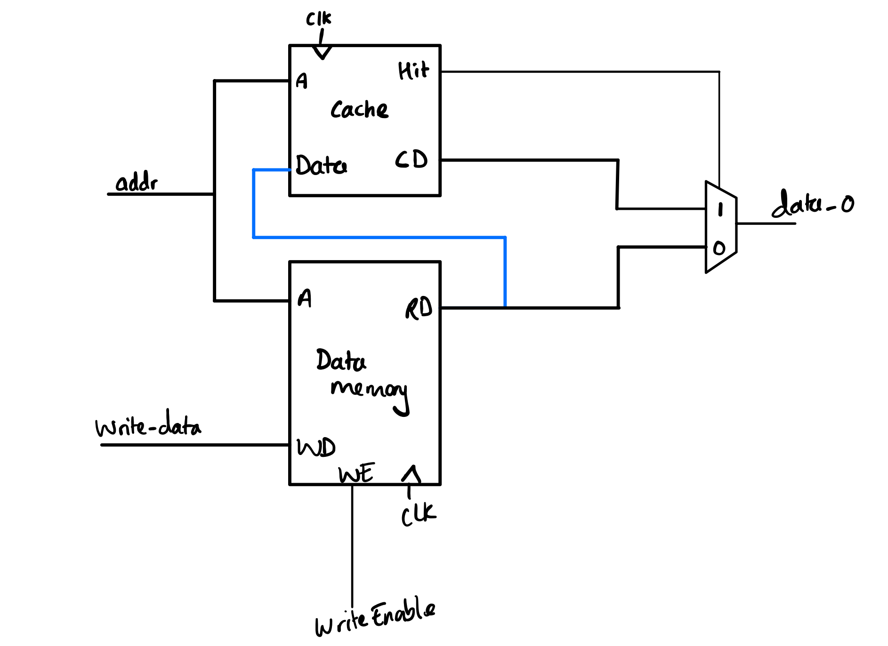

# Individual Statement - Gurjan Singh Samra
## Table of Contents
- [Overview](#overview)
- [Instruction Memory](#Instruction-Memory)
- [Sign Extend](#Sign-Extend)
- [Testing Control-Unit](#testing-control-unit)
- [Single Cycle CPU](#single-cycle-cpu)
    - [Design](#design)
    - [Testing and Debugging](#Testing-and-Debugging)
    - [Machine Code for F1](#machine-code-for-f1)
    - [Register File](#register-file)
    - [ALU](#alu)
    - [Data Memory](#data-memory)
    - [Working CPU](#working-cpu)
- [Debugging Pipelining](#Debugging-Pipelining)
- [Cache](#Cache)
    - [Direct Mapping Cache](#Direct-Mapping-Cache)
    - [Two-way Associative Cache](#Two-way-associative-cache)
- [Reflection](#reflection)

  
## Overview
This statement gives an overview of my contributions to the project. All design decisions, modules, files, and any relevant structural or minor changes are detailed in the sections below:

My main roles were:

* Full responsibility of writing, designing, and testing the [Sign Extend](path/to/Sign-Extend), [Instruction Memory](path/to/Instruction-Memory).
* Full responsibility of writing, designing, and testing the [Single Cycle CPU](path/to/single-cycle).
* Debugging any files that aren't functioning correctly.
* Minor contributions on helping to debug [pipelining](path/to/pipelining).
* Minor contributions in debugging the [Two-way Associative Cache](path/to/2way)
* Implementing both types of [cache] into the pipelined CPU.

## Instruction Memory

### Module Description
The Instruction Memory holds the instruction set, with an input for the address (which is a multiple of 4 due to byte addressing), outputting the corresponding instruction to the relevant components.

For the Instruction Memory, I used the ROM file from the previous Lab 4 CPU, since there weren't many changes that needed to be made. I had to make a small tweak to the file in order to make the byte addresssing little endian, as opposed to big endian.

### Testing

To test the Instruction Memory, I created a testbench which would input the clock cycle number multiplied by 4 as the address. This will give an output of the instuction memory, as shown in the waveform below:


As you can see, the Instructon Memory is working as expected. ([commit](https://github.com/zoezheng04/Team-8/commit/e67034616b1cd96eefeac8041b371dea3d4c3f10))

## Sign Extend

### Module Discription

The Sign Extend Module takes in an input supplied by the Instruction Memory. This is then sign extended according to the relevent ImmSrc signal given by the Control Unit.

### Creating the Design

To implement the Sign Extend, I used the table outlining the different types of sign extends, which was provided in the lectures.


As you can see in the table, there are 5 types of sign extend which are needed to run the reference and f1 programmes. Therefore, ImmSrc will need to be 3 bits as opposed to 2, which is what was shown in the lecture diagram.

I then created the file, for which the code can be seen below.

```System Verilog
module SignExtend#(
        parameter DATA_WIDTH = 32
)(
    input logic [DATA_WIDTH-1:0]    Imm_i,
    input logic [2:0]               ImmSrc,
    output logic [DATA_WIDTH-1:0]   Imm_o
);

always_comb begin
    case(ImmSrc)
    //I-type
    3'b000: Imm_o = {{21{Imm_i[31]}}, Imm_i[30:20]};
    //U-type
    3'b001: Imm_o = {Imm_i[31:12], 12'b0};
    //S-type
    3'b010: Imm_o = {{21{Imm_i[31]}}, Imm_i[30:25], Imm_i[11:7]};
    //B-type
    3'b011: Imm_o = {{20{Imm_i[31]}}, Imm_i[7], Imm_i[30:25], Imm_i[11:8], 1'b0};
    //J-type
    3'b100: Imm_o = {{12{Imm_i[31]}}, Imm_i[19:12], Imm_i[20], Imm_i[30:21], 1'b0};
    endcase
end

endmodule
```

### Testing


I tested the sign extend component by creating a ROM, which contained a few 32 bit values; these are sign extended by the SignExtend component. I manually changed the ImmSrc through the testbench, since I was testing this without the control unit. I used the ROM file I had already created.([commit](https://github.com/zoezheng04/Team-8/commit/8deafdd4bcd85961811da103f1514683d156d496))

Pictures of each waveform for it's corresponding ImmSrc value:

ImmSrc = 0:


ImmSrc = 1:


ImmSrc = 2:


ImmSrc = 3:


ImmSrc = 4:


## Testing Control Unit

After Arjan had finished making the Control Unit, I, with the aid of Arjan, tested it using a Programme Counter and a ROM file containg the reference programme. We used the reference programme since it contained all types of instructions, so we could test the control unit rigorously. I created a top file containing the Control Unit alongside the PC and ROM. All the signals of the Control Unit were set as the outputs. I checked the waveform to see if the corresponding opcode supplied by the ROM was given the correct signals as outputs, which can be seen below.([commit](https://github.com/zoezheng04/Team-8/commit/393afede862866801644593bc12f0e32e1fb5a0f))


## Single Cycle CPU

I was responsible for creating, testing and debugging the Single Cycle CPU, which was a crucial part of this project. It was essential that the Single Cycle CPU fully functioned as intended, allowing us to attempt the stretched goals.

I did most of the debugging alone, which was challenging, as it required me to go over all the components made by everyone and make any necessary changes. I had the same role in Lab 4, which helped, as I was famiilar with all the different components.

### Design

Before creating the top file, I drew out a schematic diagram for the single cycle CPU. It was quite similar to the diagram shown in lectures, however, it included various muxes to implement the jump instructions and include the trigger.

We had decided to implement all the muxes in the top file as opposed to the component files. This would make it easier to test each component before putting the CPU together, helping reduce errors, making the debugging easier.

For the trigger, I added it so that it functions like a overridde start/reset button, so when pressed it will start the programme from the beginning. If not pressed at the beginning, it will remain at the start at 0.


### Testing and Debugging

At first I tested the CPU with the counter from Lab 4, since we knew that the counter machine code was working from the previous lab.

When testing the CPU, there was an error which would cause Verilator to abort. This was because there wasn't a 'dc convergence'. This was the first time I had seen such an error and therefore was unsure as how to debug this. After discussing with the team, I broke down the top file into 4 different top files for various stages, and then created another top file to put them all together. This allowed me to test the 4 different stages independently for errors, helping me solve the problem.([commit](https://github.com/zoezheng04/Team-8/commit/a59c95c0c4fb2b720fcfe34eb5130a01b0c0bc4d))


After making this change and testing all the top files individually, the CPU worked for the counter!

Here's a video of the counter working:

https://github.com/zoezheng04/Team-8/assets/147711636/d6376b9e-e7d6-40d7-9c28-c5cd889fde58


### Machine Code for F1

For the machine code, I wrote out a rough programme using the counter programme from Lab 4, which Natalie then improved.

For the random delay after the all the lights were on, we used a lfsr using xor's to make it random, which I got from this [website](https://www.schneier.com/academic/archives/1994/09/pseudo-random_sequen.html). I then passed this onto Natalie who made the necessary adjustments.

When testing the f1 machine code, there was a problem with the jump instructions. This was because we had nested subroutines, which meant that the return address for the main instruction was lost. This would cause the return address of the main loop to be lost, causing the PC to jump to the wrong line of the machine code.

A solution to this could’ve been to store the return address of the main instruction in a register. However when looking at the machine code, there was no need to have a nested subroutine, as the jump was to the next line in the machine code so the PC would automatically go to that line anyway. Therfore, I just removed the unnecessary jumps which fixed that error.

There were also a few small errors in the machine code as well, such as using bne instead of beq, which were easy fixes. ([commit](https://github.com/zoezheng04/Team-8/commit/2da7dd0318fe400977b4cc3f78c983215cb208e7))

The final machine code can be viewed in the main.

After fixing the issues with the machine code, the f1 lights were working as expected.

https://github.com/zoezheng04/Team-8/assets/147711636/2e7c8578-c589-4292-a6c6-87f39a073d9f


### Register File

When testing the reference programme, a problem that occurred was that when we wrote to the zero register, it actually stored the value rather than setting it back to zero. Therefore the property of the zero register wouldn’t hold, and RET instructions couldn't be execucted properly. To solve this problem, I changed the register file so that it would always write 0 to the zero register. After I made this change, the zero register functioned as expected, allowing us to use RET properly. ([commit](https://github.com/zoezheng04/Team-8/commit/2da7dd0318fe400977b4cc3f78c983215cb208e7))

```System Verilog
always_ff @(posedge clk) begin
    registers[0] <= 32'b0;
    if(WE3)
        registers[AD3] <= WD3;
end
```

### ALU

There was a problem with the LBU instruction. The address of the Data Memory, from where the data is supposed to be loaded, was wrong. The ALU was outputting SrcB, which only provided the offset, whereas we needed the offset plus the address, hence we were always loading from the address 0.


After checking the ALU file, I noticed the following error: the addressing for the data memory was wrong; which I then ammended. The changes can be viewed through the [commit](https://github.com/zoezheng04/Team-8/commit/21f294281fd50dee8bbaded092bf4d8e6ee10b21)

The issue was that the alu was zero, therefore extending the address, instead of the data being zero extended. To fix this, I equated the address to the sum of the 2 inputs, allowing the alu to give us the address with an offset. The rest of the changes were made to the [Data Memory](#data-memory)

Alongside this, I also made a few changes to the bne and beq instructions since they were outputting single bits, when infact a 32 bit signal was expected, thus causing a warning ([commit](https://github.com/zoezheng04/Team-8/commit/98a181ebcc0473b54c38a991b15bdcf80a8a0cfc)). To fix this, I changed the bne and beq instructions to use xor, since xor has the property of =. If the you xor 2 values which are the same, then the ooutput will be zero. Using this, if you xor the 2 values and get zero, then they are equal.

This made me realise that the alu could be significantly optimised, since most of the instructions use the same fundamental operations. If I was to do a project like this again, this would be an improvment that I would implement.

### Data Memory
The reference programme uses load byte instructions, for which we had no hardware implemented. Natalie made the changes needed in the Data Memory, I then added these changes to the relevant top file. ([commit](https://github.com/zoezheng04/Team-8/commit/98a181ebcc0473b54c38a991b15bdcf80a8a0cfc))

### Working CPU

After debugging all the files, I finally managed to get the single cycle cpu to work!

Here's evindence of it working:

Gaussian:


https://github.com/zoezheng04/Team-8/assets/147711636/fa21a9e7-d59f-41e3-b83e-477cc65ddcc9


Sine:


https://github.com/zoezheng04/Team-8/assets/147711636/7aaab7ee-ca89-4b1b-afef-e08114283808


Noisy:


https://github.com/zoezheng04/Team-8/assets/147711636/80f24e6c-7d9b-461e-859d-8e686d60ed11


Triangle:


https://github.com/zoezheng04/Team-8/assets/147711636/eda1a01e-ea48-4e45-9594-88f505ae7ad8


## Debugging Pipelining

After completing the single cycle CPU, I also helped Arjan with the debugging of the pipelined CPU by providing verbal advice.

One problem we faced was that the branch instructions weren’t working properly. The problem was that the branch instructions needed a delay of 2 clock cycles, but we only had one. To temporarily test this, we added a NOP after each branch instruction and the f1 programme was being executed as expected. However, using a NOP would defeat the purpose of the hazard unit, so we discussed how to implement this in the cpu; we came with the idea of adding another register to implement 2 stalls. Arjan then went on to implement the necessary changes.

When testing with the reference programme, there was a problem with the load instructions. Looking at the waveform, I saw that the problem was that the MemType and ResultSrc flags were high after the memory was supposed to be accessed. This was due to the pipelining registers. Therefore the result of the ALU, which is the address of the memory, was being outputted instead of the data located at that address. I passed this one to Arjan, who then implemented the necessary changes

## Cache

My role with the cache was to implement the cache into the pipelined CPU. I did this by creating a top file for the memory which contained the main memory and the cache.

### Direct Mapping Cache

Implementimng the direct mapping cache wasn't too complex. I first created a diagram to allow me to visualise how the cache will link with the main memory.



After drawing the diagram, I created the top file to implementing the cache. ([commit](https://github.com/zoezheng04/Team-8/commit/37275f94e7ba441b0a5b1b33ca261f8477e418b6)) I then tested the cache and it worked! Evidence of it working can be viewed in the main READme file.

### Two-way Associative Cache

Unfortunately, we didn't have enough time to get the two-way associative cache to work with the CPU. However, I did managed to get it to work by itself.

When testing the two way associative cache, there was a 'DIDNOTCONVERGE' error which was caused by the counter. This error occurred due to the combinational loop in the counter caused by the line:

```System Verilog
Lru_counter_0[data_set] = lru_counter_0[data_set] + 1
``````

To fix this, I made the whole block sequential so that the cache will output on a positive clock cycle. This fixed this issue as it allowed for a feedback loop since this is a property of squential logic ([commit](https://github.com/zoezheng04/Team-8/commit/2fe475d16562c7747c06f51c4551463826c2297f))

After that, I drew out a diagram to implement the cache into the memory. I then wrote up the top file. ([commit](https://github.com/zoezheng04/Team-8/commit/7bc86815073b0c0cfd2a241a234e2e260f85d5bf))

## Reflection

I think we worked well as a team. To maximise the amount we could get done, we worked on the majority of tasks in parallel. Such as doing the pipelining and single cycle at the same time. This allowed us to get all the tasks done by utilising each team member.

However, looking back I would've liked to contribute to pipelining more, as I didn't get to contribute much due to the lack of time. This was mainly because I was trying to debug the single cycle CPU which was crucial for the overall project achievement.

Overall, I am happy with how our group has performed as we managed to complete all streched goals. I think I contributed greatly to the overall performance of our group by geting the single cycle CPU to fully function, and implementing the cache into pipelining.
