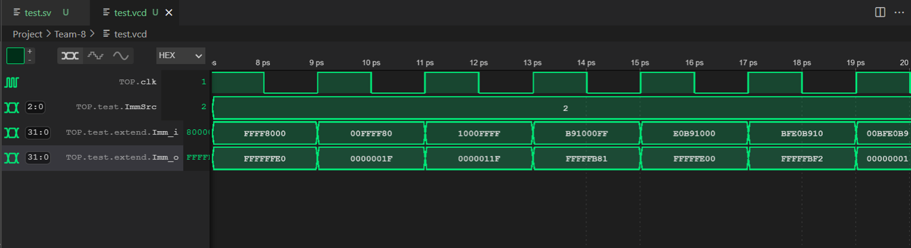

# Individual Statement - Gurjan Singh Samra
## Table of Contents
- [Overview](#overview)
- [Instruction Memory](#Instruction-Memory)
- [Sign Extend](#Sign-Extend)
- [Testing Control-Unit](#testing-control-unit)
- [Single Cycle CPU](#single-cycle)
    - [Design](#design)
    - [Testing and Debugging](#Testing-and-Debugging)
- [Debugging Pipelining](pipelining)
- [Cache](#cache)
    - [Direct Mapping Cache](#direct_cache)
    - [Two-way Associative Cache](#2way)

  
## Overview
This statement gives an overview of my contributions to the project. All design decisions, modules, files and any relevant structural or minor changes are detailed in the sections below:

My main roles were:

* Full responsibility of writing, designing and testing the [Sign Extend](path/to/Sign-Extend), [Instruction Memory](path/to/rom).
* Full responsibility of writing, designing and testing the [Single Cycle CPU](path/to/single-cycle).
* [Debugging](path/to/debugging) any files that aren't functioning correctly.
* Minor contributions on helping to debug [pipelining](path/to/pipelining).
* Minor contributions in debugging the [Two-way Associative Cache](path/to/2way)
* Implementing both types of [cache] into the pipelined CPU.

## Instruction Memory

### Module Description
The Instruction Memory holds the instruction set, with an input for the address (which is a multiple of 4 due to byte addressing) of an instruction, outputting the instruction to the relevant components.

For the Instruction Memory, I just used the ROM file from the previous Lab 4 cpu, since there weren't many changes that needed to be made. I had to make a small tweak to the file in order to make the byte addresssing little endian as opposed to big endian.

### Testing

To test the Instruction Memory, I created a testbench which would input the clock cycle number multiplied by 4 as the address. This will give an output of the instuction memory, as shown in the waveform below:


As you can see, the Instructon Memory is working as expected.

## Sign Extend

### Module Discription

The Sign Extend Module takes in an input supplied by the Instruction Memory and sign extends it according to the relevent ImmSrc signal given by the Control Unit.

### Creating the Design

To implement the Sign Extend, I used the table of the different types of sign extends possible, which was given in the lectures.


As you can see in the table, there are 5 types of sign extend which are all needed in to run the reference and f1 programmes. Therefore ImmSrc will need to be 3 bits as opposed to 2, which is what was shown in the diagram in the lectures.

I then created the file as required for which the code can be seen below.

```System Verilog
module SignExtend#(
        parameter DATA_WIDTH = 32
)(
    input logic [DATA_WIDTH-1:0]    Imm_i,
    input logic [2:0]               ImmSrc,
    output logic [DATA_WIDTH-1:0]   Imm_o
);

always_comb begin
    case(ImmSrc)
    //I-type
    3'b000: Imm_o = {{21{Imm_i[31]}}, Imm_i[30:20]};
    //U-type
    3'b001: Imm_o = {Imm_i[31:12], 12'b0};
    //S-type
    3'b010: Imm_o = {{21{Imm_i[31]}}, Imm_i[30:25], Imm_i[11:7]};
    //B-type
    3'b011: Imm_o = {{20{Imm_i[31]}}, Imm_i[7], Imm_i[30:25], Imm_i[11:8], 1'b0};
    //J-type
    3'b100: Imm_o = {{12{Imm_i[31]}}, Imm_i[19:12], Imm_i[20], Imm_i[30:21], 1'b0};
    endcase
end

endmodule
```

### Testing


I tested the sign extend component by creating a ROM containing a few 32 bit values which are sign extended by the SignExtend component. I manually changed the ImmSrc through the testbench, since I was testing this without the control unit. I used the ROM file I had already created.

Pictures of each waveform for it's correspondin ImmSrc value:

ImmSrc = 0:


ImmSrc = 1:


ImmSrc = 2:


ImmSrc = 3:


ImmSrc = 4:


## Testing Control Unit

After Arjan had finished making the Control Unit, I, with the aid of Arjan, tested it using a Programme Counter and a ROM file containg the reference programme. We used the reference programme since it contained all types of instructions so we could test the control unit rigorously. I created a top file containing the Control Unit alongside the PC and ROM, with all the signals of the Control Unit as the outputs and checked the waveform to see if the corresponding opcode supplied by the ROM was given the correct signals as outputs, which can be seen below.


## Single Cycle CPU

I was responsible for creating, testing and debugging the Single Cycle CPU, which was a crucial part of this project since it was essential that the Single Cycle CPU fully functioned as intended if we wanted to attempt any of the stretched goals.

### Design

Before creating the top file, I drew out a schematic diagram for the single cycle cpu. It was quite similar to the diagram shown in lectures however included various muxes to implement the jump instructions and include the trigger.

We had decided to implement all the muxes in the top file instead of in the component files themselves as this would make it easier to test each component before putting the whole cpu together to reduce errors and make the debugging easie

For the trigger, I added it so that it functions like a overridde start and reset button, so when pressed it will start the programme from the beginning.


### Testing and Debugging

At first I tested the cpu with the counter from lab 4 since we knew that the counter machine code was working from the previous lab.

When testing the cpu, there was an error which would cause Verilator to abort due to there not being a dc convergence. This was the first time I had gotten such an error and was unsure on how to debug this. After discussing with the team, I broke down the top file into 4 different top files for various stages and then created another top file to put them all together. This allowed me to test the 3 different stages independently for errors and to help solve the problem.


After making this change and testing all the top files individually, the cpu worked for the counter!

Here's a video of the working counter:


