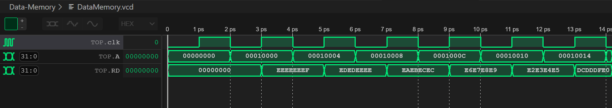
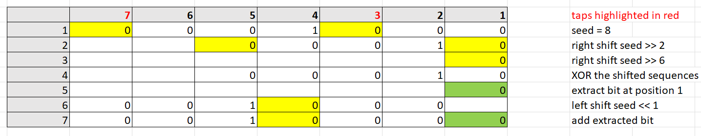
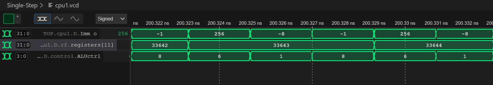

# Personal Statement of Contributions
***Natalie Lin***

---

</center>

## Overview
- [Repo Structure](#Repo-Structure) 
- [PC](#PC)
- [Data Memory](#Data-Memory)
- [F1 Program](#F1-Program)
  - [Constant Delay](#Constant-Delay)
  - [Random Delay](#Random-Delay)
- [Single-cycle Debug](#Single-cycle-Debug)
  - [ALU](#ALU)
  - [Control Unit](#Control-Unit)
  - [Testing](#Testing)
- [Reflection](#Reflection)

---

## Summary of My Contribution

My central focus during the project was the implementation of the single-cycle RV32I, a basic goal of the group project. Acknowledging the critical importance of achieving optimal functionality for our single-cycle processor, I dedicated a substantial portion of my time to creating the assembly language program for the F1 starting light algorithm. Moreover, considerable effort was devoted to debugging the single-cycle processor, which initially posed compatibility challenges with the reference program.

---

## Repo Structure

***Relevant commit:***
- [Update README.md](https://github.com/zoezheng04/Team-8/commit/2c574e15d412650dbae81de8892b47307a979cdf)

Drawing from the lessons learned in Lab 4, disorganization emerged as a significant challenge. All team members pushed untested files to the same branch, resulting in an unwieldy list of files that made locating specific files for debugging both time-consuming and challenging. Additionally, communication gaps led to the creation of duplicate files – for example, we each created a multiplexer for the component we were responsible for when the same multiplexer could essentially be used for multiple purposes.

In response, my teammate Zoe and I established a set of guidelines before initiating the current project to proactively address these issues:

- Each branch should house the code for its corresponding component along with its testbench. This not only serves as a record of our work but also facilitates easy verification and testing by other team members.
- Components must undergo testing before being pushed to GitHub.
- Collaborate with teammates for any required merging.

These guidelines were documented in the readme file of the main repository, serving as a constant reminder for the team. The implementation of these rules yielded positive results, marked by a significant improvement compared to Lab 4. I found enhanced clarity during debugging sessions, knowing precisely where to locate the necessary files.

---

## PC

***Relevant commits:***
-	[PC from Lab 4](https://github.com/zoezheng04/Team-8/commit/e458d80482b54d69b6ba4e547c9ada7abce21c9b)
-	[Fixed syntax error](https://github.com/zoezheng04/Team-8/commit/f2258b94609fd81dff4fe54cd2358634274634d8)

The PC unit remains largely unchanged from Lab 4, maintaining a straightforward design as a synchronous counter responsible for providing the address of the current instruction in execution. What made it slightly different from Lab 4 is its interconnection with other CPU components. Instead of directly linking it to a multiplexer to determine what PCNext should be (PC + 4 or PC + Imm for branch instructions) within the PC branch, we opted to handle this connection in the top file.

This strategic decision aims to improve the organisation within the rtl folder, reducing the number of files so that the clarity of functionality of each unit is enhanced for the examiner.

---

## Data Memory

***Relevant commits:***
-	[Created and tested DataMemory](https://github.com/zoezheng04/Team-8/commit/564cdbc8983a444d5dfedb559152d6db85fa3b94)
-	[Updated DataMemory for the reference program](https://github.com/zoezheng04/Team-8/commit/d50f3c1006d134147fd2a4b43b8031da8d45295d)

When initially creating the data memory, the data memory was a memory file very similar to the instruction memory but as a RAM, allowing write operations with a high WriteEnable (WE) control signal. This setup successfully executed our F1 program, which only used load and store word instructions.

However, as the design progressed, it became clear that the original data memory was not compatible with the reference program, which required load and store byte instructions. Thus, a significant modification was made to the data memory, and I will discuss this revised version here.

The data memory has an 8-bit width to handle individual bytes for load and store byte instructions. To distinguish between word and byte addressing instructions, a MemType output logic was added to the control unit. MemType is set to high for byte-addressing instructions (e.g., SB and LBU) and low for other word-addressing instructions. See the code snippets below:

Changes to the control unit:


For writing bytes to memory, the bottom 8 bits of the write data are selected, as the store byte instruction consistently stores the least significant byte in the register to memory.

Reading:
[Insert data memory code]

The data memory reads bytes in sequence, starting three addresses higher than the base word address and progressing downward. This ensures that ReadData (RD) represents the required 32-bit word in little-endian format, as seen in the waveform trace below. Note that the base word address is set to be 0x10000 as given in the brief.

<p align="center">  </p>

Writing:
[Insert data memory code]

The writing process is similar to the reading procedure. Bytes are selected from the WriteData (WD) from least to most significant bits and are stored in the base word address and the next three higher addresses respectively. This ensures that the word is stored in memory in little-endian format.

---

## F1 Program

***Relevant commit:***
-	[Created f1.s](https://github.com/zoezheng04/Team-8/commit/2431459a0c7ba1751d2bfd6c522b0d281dac6ea2)
-	[Created f1.mem](https://github.com/zoezheng04/Team-8/commit/877adb57f58872f954b2615668b628da70f32f66)
-	[Converted from big-endian to little-endian](https://github.com/zoezheng04/Team-8/commit/71c0ad3ffa4cf795af146b50890959eb7951351a)

Before developing the F1 starting light program, my teammate Gurjan and I devised a method to illuminate lights sequentially using the Shift Left Logical Immediate (SLLI) and Add Immediate (ADDI) instructions. I extended this concept to create the assembly program, incorporating constant delays between each light and introducing a random delay before turning all lights on and off. The final assembly program for the single-cycle processor is provided below:

[Insert code]

I will now dive into the specific details of the delays, as they present the most challenging aspects of our algorithm.

#### Constant Delay:

Refer to the “delay” label for the implementation. After illuminating a light, the program enters the “delay” label, counting down from a set value. The program will jump to the stored return address after the countdown gets to 0 to turn on the next light. The initial countdown value of 1 provides a flash rate close to 60 bpm (from Lab 3), as evident in the video below.

[Insert video] 

#### Random Delay:

To generate a random number, the linear feedback shift register (LFSR) was implemented. The following figure aims to make my explanation of the logic behind my code easier to understand.

<p align="center">  </p>

Refer to the “lfsr” label for this section. This 7-bit PRBS generator (from Lab 3 Task 4), with taps at positions 3 and 7, employed the 7th order primitive polynomial to provide maximal length. We initialised it with a value of 8 to ensure noticeable changes in delay. Utilising the Shift Right Logical Immediate (SRLI) instruction, we determined the bits at positions 3 and 7. XORing these 'taps' with the shifted sequences yielded the feedback bit which was then extracted using the AND Immediate (ANDI) instruction. Finally, the seed underwent a left shift by 1 bit, incorporating the extracted feedback bit at position 1. This process accurately replicated manual LFSR operations.

After generating the random number, the program proceeds to the “countdown” label. Here, it counts down from the random number before restarting the F1 starting light algorithm.

---

## Single-cycle Debug

***Relevant commits:***
-	[Testing with the reference program](https://github.com/zoezheng04/Team-8/commit/ac8c1165d04dc2822a37a17eae1a639328f71e3e)
-	[Modified control unit and data memory](https://github.com/zoezheng04/Team-8/commit/d50f3c1006d134147fd2a4b43b8031da8d45295d)
-	[Got the single-cycle to work with both the F1 program and the reference program](https://github.com/zoezheng04/Team-8/commit/faad8892f6dbe1836bd8b3c14d01cd34e5eb7f50)

#### Approach:

The initial testing of the single-cycle CPU was undertaken by my teammate Gurjan. As previously mentioned, our single-cycle implementation only functioned with our F1 program. The problem was traced to line 15 of the reference program – ADDI  a1, a1, -1. By analysing the waveform, we observed that a1 was incremented, rather than decremented. Despite spending several days on debugging, the issue remained unresolved. Due to time constraints, debugging responsibilities were then transitioned to me, while Gurjan shifted his focus to pipelining and adding cache functionality.

To enhance my understanding of the CPU's overall operation, I meticulously reviewed all the code, cross-referencing it with the lecture slides. Additionally, I addressed syntax errors and warnings to ensure the proper functioning of the CPU.

#### ALU:

I initiated the debugging process by employing the ALU testbench created by my teammate Zoe. While the Add instruction was executed correctly, I identified certain ALU operations that required correction. The subsequent section outlines the modifications I made:

[Insert code]

#### Control Unit:

Knowing that the issue did not stem from the ALU, I proceeded to test the sign extension unit, which operated flawlessly. Considering my teammate Gurjan's successful substitution of the line with a SUB instruction, achieving the desired plots, I narrowed down the problem to either the control unit or the top file.

After numerous trial-and-error attempts, I pinpointed the root cause to be the ALUCtrl control signal. It was erroneously outputting the signal for an SUB operation instead of an ADD operation, as depicted in the waveform below. 

<p align="center">  </p>

>Note that the binary representation of 8 (1000) corresponds to our SUB operation in the ALU.

To rectify the issue, I scrutinised the machine code. Upon reviewing the table below, I recognised that distinguishing between an ADD and an SUB operation with signed numbers required consideration of not only funct7 (bit 30 of the machine code) but also the opcode, specifically opcode[5]. It became evident that opcode[5] was the sole bit differentiating between them.

The solution was straightforward – I introduced a 2-bit logic named opfunct7, factoring in both opcode[5] and funct7. For our processor, designed exclusively for our F1 program and the reference program, it now implements an SUB operation only when both opcode[5] and funct7 are high. The modification is illustrated below:

```systemverilog
logic [1:0] opfunct7;

assign opfunct7 = {opcode[5], funct7};

...

case (Type_O)
        Type_R, Type_I_ALU:
            case(funct3)
                3'b000: begin
                    if(opfunct7 == 2'b11) begin
                        ImmSrc = 3'b000;
                        ALUctrl = 4'b1000; // SUB
                        MemType = 1'b0;
                    end 
                    else begin
                        ALUctrl = 4'b0000; // ADD
                        ImmSrc = 3'b000;
                        MemType = 1'b0;
                    end
                end
```

#### Testing:

In creating the testbench to evaluate our CPU with the reference program, my first mistake was printing the number of cycles, despite having set the condition for plotting not to start until clock cycle 330000. My intention was to confirm Vbuddy was running, but printing every cycle proved time-consuming, taking over an hour to reach just 40000 cycles, with much more to go.

After discussing the issue with my teammates as well as another team, we found a more efficient solution: initiating both printing and plotting only after reaching the desired clock cycle. Another error I made was setting the trigger based on the vbdFlag() function. Unlike the F1 program, the trigger should be consistently high, allowing the function to build the distribution over multiple clock cycles.

The output section of the testbench is as follows:
[Insert code]
              
See “v1.0-Single-Cycle” branch for the result graphs.

---

## Reflection

To conclude, I enjoyed my time working on this project. It provided me with a more profound and robust understanding of CPU operations compared to individual labs. The exposure to RISC-V, SystemVerilog, and general hardware design added valuable layers to my knowledge. Additionally, the opportunity to write in Markdown through the documentation phase was a valuable aspect of the experience.

Given more time, I would opt for a smaller ALU. During debugging, I noticed that certain instructions shared identical ALU operations. For instance, ADD, JALR, and LBU could all be executed using the addition of two operands. This insight suggests the potential to streamline the ALU by using a common ALUCtrl control signal for multiple instructions, minimising redundant operations.

Looking back, I would allocate more time to thorough planning, particularly for the changes made and our respective responsibilities. This would allow us to complete the single-cycle stage earlier, instead of concurrently tackling single-cycle, pipelining, and cache memory in the final week of the project. Not only does this approach enhance debugging efficiency, but it also affords more time to explore additional features.
