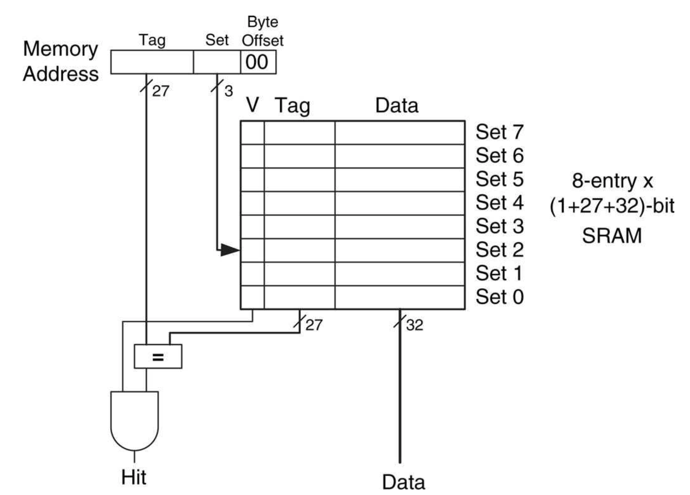
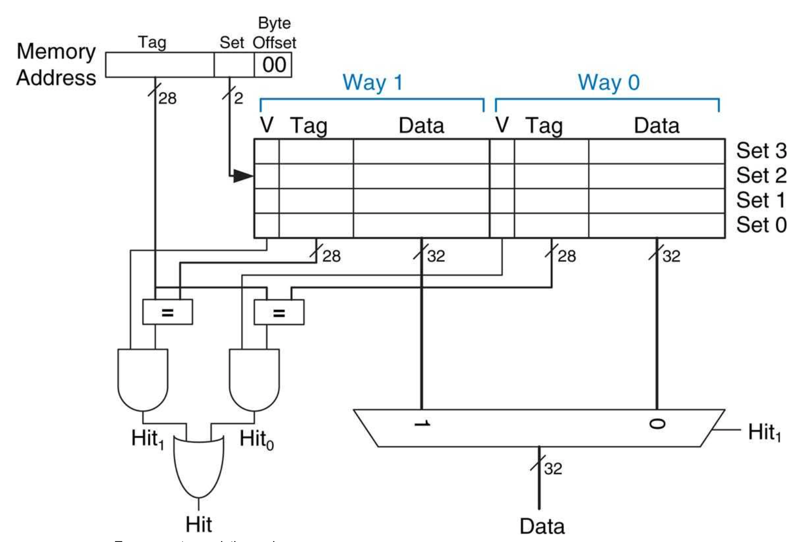

# Individual Statement - Zoe Zheng
## Table of Contents
- [Overview](#overview)
- [Register File](#register-file)
- [ALU](#alu)
- [Cache](#cache)
  - [Direct Mapped Cache](#direct-mapped-cache)
  - [Two Way Set Associative Cache](#two-way-set-associative-cache)
- [Reflection](#reflection)
  
## Overview
This individual statement provides a comprehensive overview of my contributions to the project. Each section details specific modules or features I worked on, relevant commits, and design decisions made during the implementation.
The following are my contributions:
* Wrote, tested and debugged the [ALU](path/to/ALU/file), [Register File](path/to/Regfile/file) and relevant MUXs
* Wrote, tested and debugged the [Cache](path/to/Cache/file)
* Assisted in debugging Single Cycle design
* Assisted in integrating data cache with the pipelined RISC-V CPU
* Responsible for maintaining Git Repo structure and writing README.md file

## Register File
### Module Description
I first started making the register file. The Register File module consists of an array of registers, each capable of holding data of the specified width of 5 bits. In the context of the project, this register file supports 32 registers.

### Read and Write Operations
To support read operations, the Register File module dynamically selects the read addresses based on the instruction's encoding. 

```System Verilog
//Read from register
assign RD1 = registers[AD1];
assign RD2 = registers[AD2];
assign a0 = registers[10];
endmodule
```
In contrast, write operations are executed on the rising edge of the clock signal when the corresponding write enable signal is asserted. This synchronous design ensures data integrity and consistency during various phases of the processor's operation.
```System Verilog
//Write to register
always_ff @(posedge clk) begin
    if(WE3)
        registers[AD3] <= WD3;
end
```

## ALU
### Module Description
Upon completing the register file, I started implementing the ALU. The ALU takes two source operands, SrcA and SrcB, along with a 4-bit ALUControl signal from the Control Unit. It produces the ALUResult as the output, representing the result of the specified operation, and a Zero flag indicating whether the result is zero.
### Supported Instructions
The supported instructions of the ALU were determined based on the instructions used in the reference program as well as f1 program we wrote. The ALUControl signal selects one of the instructions to be executed, there are a total of  14 supported instructions required, so we chose the ALUControl signal to be 4 bits to accomodate this.
```System Verilog
case (ALUControl)
        4'b0000: ALUResult = SrcA + SrcB; //ADD 
        4'b0001: ALUResult = (SrcA ^ SrcB);
        4'b0010: ALUResult = SrcB; //JAL
        4'b0011: ALUResult = SrcA + SrcB; //JALR
        4'b0100: ALUResult = {SrcB[31:12], 12'b0};
        4'b0101: ALUResult = {24'b0, SrcB[7:0]}; //LBU
        4'b0110: ALUResult = SrcA + SrcB; //SB
        4'b0111: ALUResult = SrcA << SrcB[4:0]; //SLL
        4'b1000: ALUResult = SrcA - SrcB; //SUB
        4'b1001: ALUResult = SrcA >> SrcB[4:0];//SRL
        4'b1010: ALUResult = SrcA ^ SrcB; //XOR
        4'b1011: ALUResult = SrcA | SrcB; //OR
        4'b1100: ALUResult = SrcA & SrcB; //AND
        4'b1101: ALUResult = SrcA - SrcB; //BEQ
        default:
            ALUResult = 0;
    endcase;
```
### Zero Flag
The Zero flag is set to 1 if the ALUResult is zero, providing a status indicator for conditional branching in the RISC-V processor.
```System Verilog
case (ALUResult)
        32'b0: Zero = 1'b1;
        default: Zero = 1'b0;
    endcase;
```
### Testing
Upon completion of the ALU design, I wrote a testbench for verification. The testbench sets the input SrcA and SrcB to certain values, loops through all 14 instructions and outputs the ALUResult and Zero Flag
The output I got from the testbench verifies my ALU design. Below is the output when SrcA is set to 3 and SrcB is set to 5:


## Cache
To enhance overall system performance by mitigating memory access latencies, I worked on designing and integrating a cache into our RISC-V processor. The cache acts as a high-speed, intermediary storage between the processor and main memory, allowing for faster retrieval of frequently accessed data. 

The cache is used to store recently accessed data and caching contiguous blocks of memory, addressing both temporal locality and spatial locality, reducing the need to fetch the same data repeatedly from slower main memory and anticipating adjacent data will be accessed in sequence.

### Direct Mapped Cache
The initial phase of my cache design involved the creation of the Direct Mapped Cache module. This design employs a direct mapping strategy, associating each memory block with a specific cache location. The module is parameterized to support various data widths and cache configurations. 

#### Cache Organization
The module consists of an array of cache lines, each with its validity bit (V), tag, and data storage. The cache width (CACHE_WIDTH) determines the number of lines, allowing for a balance between storage capacity and access speed.

#### Tag and Set Calculations
For each memory address presented to the cache, the module calculates the corresponding set and tag components. The set is determined by a subset of bits from the memory address (data_set), while the tag comprises the remaining bits (data_tag). These calculations facilitate efficient indexing and retrieval of data within the cache.



#### Cache Hit
A cache hit occurs when the presented memory address matches the stored tag in the identified set, indicating that the required data is already present in the cache. 
```System Verilog
assign cache_hit = ((tag == data_tag) && V);
```
In this case, the module efficiently retrieves the data from the cache, minimizing latency associated with main memory access.
```System Verilog
always_comb begin
    if (cache_hit) cache_data = data[data_set];
end
```
#### Cache Miss
A cache miss occurs when the presented memory address does not match the stored tag in the identified set, signifying that the required data is not present in the cache. The cache hit signal is set to 0. The module handles 2 types of misses:
1. Compulsory Miss: occurs when the cache is initially empty, and the requested data has never been loaded into the cache before.
2. Capacity Miss: occurs when the cache is already populated, but there is not enough space to accommodate additional data that needs to be cached. 
In a direct mapped cache, in both cases, the module initiates the process of fetching the required data from the main memory, and the cache line is updated with the new tag, data, and a valid bit (V) to mark its availability.

#### Overwrite and Conflict Resolution
The module provides a mechanism for overwriting data in the cache. The overwrite signal controls this behavior. If enabled, the module writes to the cache line with the new data:
```System Verilog
if (overwrite) begin
  // Write operation
  V[data_set] <= 1;
  tag[data_set] <= data_tag;
  data[data_set] <= wr_data;
end 
```
While the direct mapped cache design simplifies the mapping of memory addresses to cache lines, it introduces the potential for conflicts when multiple addresses map to the same set. The module employs a straightforward conflict resolution strategy—overwriting the existing data in the cache with the new data. This strategy ensures the cache remains coherent with the most recently accessed or modified data.

#### Testing and Implementing the Direct Mapped Cache to the RISC-V Design
Upon completing the desing of the direct mapped cache, I proceeded verify its functionality. I wrote a testbench that first wrote some data to the cache, and performs read operations on the cache and prints out the cache outputs, and it functioned as expected: when there is a cache hit, the cache outputs the data, when there is a cache miss, the output data is set to 0, and the cache miss signal promps the cache to fetch the data from the main memory so to prevent cache miss when this data is accessed again in the future.


Once the direct mapped cache design was verified, I proceeded to work with my teammate Gurjan to implement it to the top file for the pipelined RISC-V Design, I provided him with the expected behaviour of the cache from a top level view.

### Two Way Set Associative Cache
Upon completing the direct mapped cache and a verified version of the pipelined RISC-V with data memory cache, recognizing the limitations of the direct-mapped cache, I moved on to develop a more sophisticated two way set associative cache. The two way set associative cache is designed to optimize memory access by providing a compromise between the simplicity of a direct-mapped cache and the flexibility of a fully associative cache. This cache design reduces conflicts by allowing multiple lines in a set, improving overall cache performance.


#### Address Mapping
In the Two-Way Set Associative Cache, the memory address is still used to determine the set and tag components. However, with two cache lines per set, the potential for conflicts is mitigated, and multiple addresses can coexist in the same set without causing unnecessary cache misses.

#### Write Policy
In my Two-Way Set Associative Cache design, I chose to implement a write-back cache which stores modifications only in the cache initially, and writes back to the main memory with the updated data during eviction. The reason being that a write-back cache reduces memory traffic and enhances overall performance through the delayed and optimized updating of modified data to the main memory.

In order to implement a write back cache, in addtion to the valid bit, tag and data, I've also added a dirty bit (D_0/D_1), which is set when the data is modified in the cache locally, and is used as a signal to write back to the main memory during eviction.

#### Eviction Policy
In a Two-Way Set Associative Cache, since there are 2 ways in a set, in the event of a capacity miss, we need to decide which way to evict. Therefore it is necessary to include an  eviction policy. I chose to use the LRU (Least Recently Used) eviction policy by keeping a counter on each cache way to track their use, and during the event of a capacity miss, the cache checks the counter and evicts the least recently used way.
```System Verilog
// LRU counter
logic lru_counter_0 [CACHE_LENGTH-1:0];
logic lru_counter_1 [CACHE_LENGTH-1:0];
``` 

#### Cache Organization
Unlike the Direct Mapped Cache, the Two-Way Set Associative Cache employs a set-associative organization, dividing the cache into multiple sets, each containing two cache lines. This departure from the direct-mapped approach allows for multiple addresses to map to the same set, reducing conflicts and enhancing cache utilization.

```System Verilog
//cache array
logic                   V_0     [CACHE_LENGTH-1:0];
logic                   D_0     [CACHE_LENGTH-1:0]; //dirty bit
logic [TAG_WIDTH-1:0]   tag_0   [CACHE_LENGTH-1:0];
logic [DATA_WIDTH-1:0]  data_0  [CACHE_LENGTH-1:0];

logic                   V_1     [CACHE_LENGTH-1:0];
logic                   D_1     [CACHE_LENGTH-1:0];
logic [TAG_WIDTH-1:0]   tag_1   [CACHE_LENGTH-1:0];
logic [DATA_WIDTH-1:0]  data_1  [CACHE_LENGTH-1:0];
``` 

#### Cache Hit
The Two-Way Set Associative Cache retains the concepts of cache hits and misses, but with the added sophistication of associativity. A cache hit occurs when the presented memory address matches the stored tag in either of the two cache lines within the selected set. 
```System Verilog
assign cache_hit = cache_hit_0 || cache_hit_1;
```
The module employs parallel comparison logic to determine which way contains the required data. The selected cache line's data is then outputted as the cache hit result. The data output in this cache design is controlled by a mux that dynamically selects between two ways: Way 0 and Way 1. The decision is contingent upon the state of cache_hit_1. If cache_hit_1 is asserted, the mux outputs data from Way 1; otherwise, it outputs data from Way 0.
```System Verilog
if(cache_hit) begin
        if(cache_hit_1) cache_data = data_1[data_set];
        else cache_data = data_0[data_set];
    end
```
#### Cache Miss
Different from the direct mapped cache, the Two-Way Set Associative Cache handles the 2 types of misses seperately:
##### 1. Compulsory Miss
In the event of a compulsory miss, the module updates the tag, data, and valid bit, sets the dirty bit (D_0), and set the LRU counter (lru_counter_0) of the way that does not contain valid data:
```System Verilog
//compulsory miss
    if(!V_0[data_set]) begin
        tag_0[data_set] <= data_tag;
        data_0[data_set] <= data;
        V_0[data_set] <= 1'b1;
        D_0[data_set] <= 1'b0;
        lru_counter_0[data_set] <= 0;
    end
    else if (!V_1[data_set]) begin
        tag_1[data_set] <= data_tag;
        data_1[data_set] <= data;
        V_1[data_set] <= 1'b1;
        D_1[data_set] <= 1'b0;
        lru_counter_1[data_set] <= 0;
    end
```
##### 2. Capacity Miss
In the event of a capacity miss, the module compares the LRU counters of the two cache ways for the given set to evict the least recently used data and write in the new data, if the dirty bit of the evicted data is set, it writes back to the main memory, updating the data.
```System Verilog
//capacity miss -> LRU eviction policy
else if (V_1[data_set] && V_0[data_set]) begin
    if (lru_counter_0[data_set] < lru_counter_1[data_set]) begin
        if(D_0[data_set]) begin //write back to main mem
            write_back_data <= data_0[data_set];
            write_back_address <= {tag_0[data_set], data_set, {OFFSET_WIDTH{1'b0}}};
            write_back_enable <= 1'b1;
            D_0[data_set] <= 1'b0;
        end
        //evict and fill
        tag_0[data_set] <= data_tag;
        data_0[data_set] <= data;
        lru_counter_0[data_set] <= 0;
    end
```
#### Testing and Implementing to RISC-V
Upon completing the design of a Two-Way Set Associative Cache, I attempted to test and implement it to the RISC-V CPU along with my teammate Gurjan. However, we did not have enough time to fully implement the Two-Way Set Associative Cache, therefore our final version of the pipelined RISC-V CPU with data cache uses our initial design of a direct-mapped cache.

## Reflection
### What I learend...
#### 1. Github
Throughout this project, I gained valuable insights into efficient Git usage. I learned how to adeptly manage repositories, execute push and pull operations. As the master of the github repo, I monitored the repo and worked on the README.md file, through this I learned how to use markdown and gained valuable skills leveraging various features to streamline project management and collaboration. 
#### 2. System Verilog
The project provided a deep dive into System Verilog and hardware design. From designing, translating schematics to HDL, I acquired a comprehensive understanding of hardware design principles and their implementation.
#### 3. Testing and Debugging
Testing and debugging became a central part of my workflow for this project. I honed my skills in writing effective testbenches, addressing corner cases, and meticulously verifying functionality. The substantial debugging process also enhanced my problem-solving abilities.
#### 4. Collaboration
Collaboration skills were a key takeaway of this project. I learned how to efficiently organize workloads, distribute tasks, and collaborate effectively when encountering challenges. Utilizing Github as a collaboration tool and cross-checking other team member's code became integral to our collaborative success.
### What I would do differently...
Reflecting on the project, I realize the importance of a more structured testing approach. When working on the two way set associative cache, I continued making the design more complex without testing, and it became difficult to test and debug at the end. In the future, I would prioritize testing individual components before introducing new features. Striking a balance between testing and implementation would be key, as this approach proves crucial when dealing with larger codebases, making debugging more manageable.
